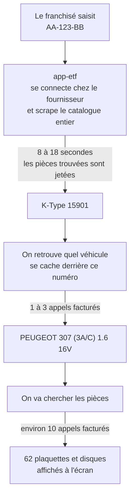
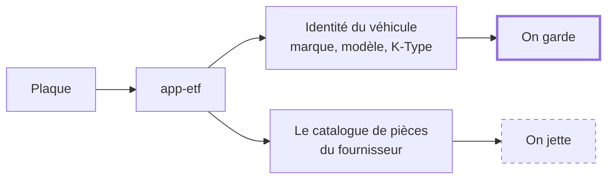
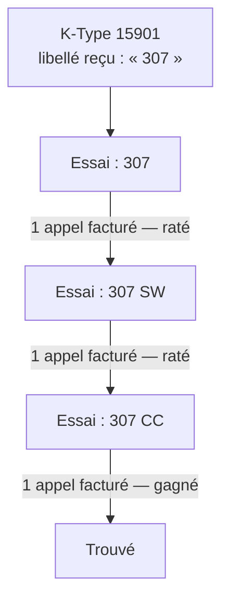
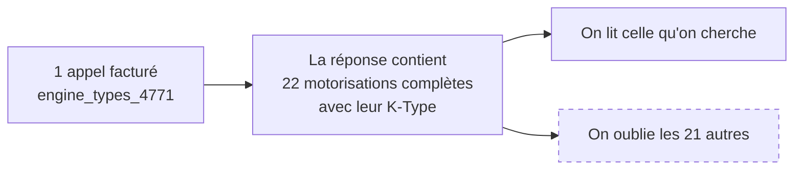
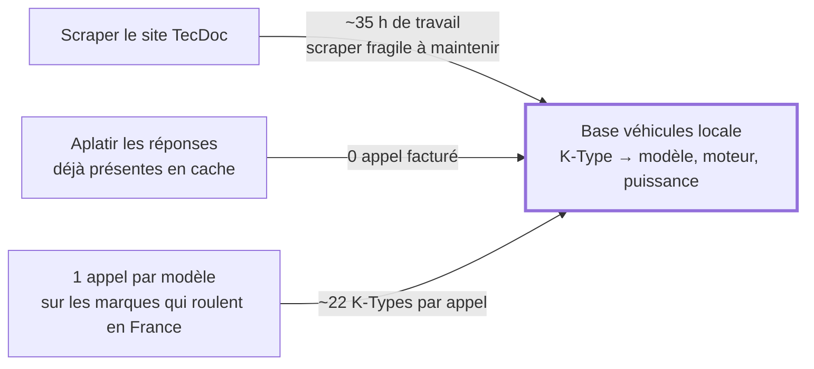
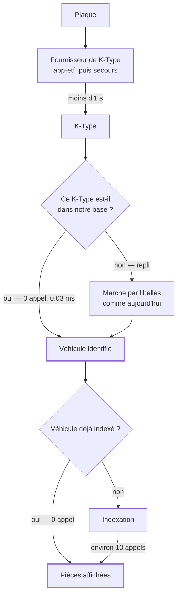
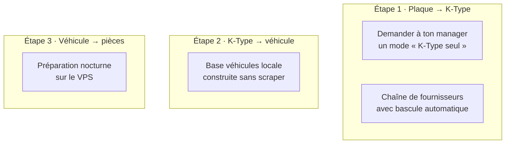

# Du numéro de plaque à la pièce affichée

Ce document explique où passent le temps et l'argent quand un franchisé cherche
des plaquettes, et quelles décisions sont sur la table.

Un seul chiffre à garder en tête : **un appel facturé**, c'est une requête payée
à RapidAPI. Tout le reste en découle.

Ce document est l'analyse qui a mené à l'état actuel, gardée telle quelle pour le
raisonnement. Son « aujourd'hui » décrit le passage par app-etf, qui n'existe
plus : la plaque est résolue chez Exadis en une requête, et app-etf a été retiré
parce qu'il lisait son propre K-Type chez Exadis, donc ne couvrait pas la panne
qu'il était censé couvrir. Le README décrit le flux en vigueur.

---

## 1. Ce qui se passe aujourd'hui

Trois étapes, trois natures de coût très différentes :

| Étape | Qui répond | Ce que ça coûte |
|---|---|---|
| Plaque → K-Type | app-etf | 8 à 18 secondes d'attente, 0 appel facturé |
| K-Type → véhicule | RapidAPI | 1 à 3 appels facturés |
| Véhicule → pièces | RapidAPI | environ 10 appels facturés |

La troisième étape est déjà bien optimisée : un véhicule déjà vu coûte 0, un
véhicule sœur coûte 3 au lieu de 10.

Les deux premières, non. Voici pourquoi.

---

## 2. Premier gaspillage : on attend un scrape dont on jette le résultat

app-etf sait faire une chose dont on a absolument besoin : traduire une plaque en
K-Type. Mais pour la faire, il scrape tout le catalogue du fournisseur.

Le service fait un scrape produits complet de 8 à 18 secondes, et on ne conserve
que l'en-tête véhicule.

Conséquence concrète : le franchisé regarde un écran de chargement pendant une
dizaine de secondes pour obtenir un numéro.

---

## 3. Deuxième gaspillage : on rachète une information qu'on possède déjà

Le K-Type seul ne suffit pas : il faut savoir de quel modèle il s'agit. RapidAPI
n'a pas d'endpoint qui répond à « ce K-Type, c'est quoi ? ». Alors notre code
remonte la piste par les libellés, et essaie les modèles candidats un par un.

Chaque essai est un appel facturé. Et c'est là que se cache le vrai gisement :

Ce n'est pas une hypothèse, c'est mesuré dans ta base : les deux réponses
`engine_types` en cache contiennent 22 motorisations chacune. Soit **44 K-Types
déjà payés qui dorment sans servir**. Tu as aussi 209 et 172 modèles en cache, et
698 marques.

---

## 4. L'idée : se constituer une base véhicules, sans scraper

Ton manager propose de scraper le site TecDoc pour avoir notre propre base
véhicules. L'objectif est le bon. Le moyen peut être bien moins coûteux.

La table qui accueillerait tout ça, `td_vehicle`, **existe déjà** et a exactement
les bonnes colonnes : K-Type, marque, modèle, motorisation, puissance, carburant,
carrosserie, codes moteur, dates de construction. Elle contient 6 lignes
aujourd'hui.

Ordre de grandeur pour la troisième voie, à confirmer par un essai réel : en
ciblant la douzaine de marques qui roulent vraiment en France et en écartant les
modèles trop anciens, on est autour de **500 à 700 appels facturés une seule
fois**, pour une dizaine de milliers de K-Types.

---

## 5. Le flux obtenu

Les deux premières boîtes de décision sont en place depuis cette itération.

En régime établi, une recherche par plaque devient : un appel externe court, zéro
appel facturé, réponse en millisecondes.

| | Aujourd'hui | Après |
|---|---|---|
| Attente sur la plaque | 8 à 18 s | moins d'1 s |
| K-Type → véhicule | 1 à 3 appels facturés | 0 |
| Véhicule déjà connu | 0 appel | 0 appel |
| Véhicule inconnu | environ 10 appels | environ 10 appels |
| Si app-etf tombe | recherche par plaque morte | on bascule sur un autre fournisseur |

---

## 6. Les trois leviers, un par étape

**Étape 1.** Le geste le plus rentable ne coûte qu'un message : demander un mode
qui renvoie le K-Type sans scraper les produits. On passe de 8-18 s à moins d'une
seconde. Ensuite seulement, ajouter des fournisseurs de secours (Distriauto,
Oscaro) pour ne plus dépendre d'un seul service.

**Étape 2.** La base véhicules locale. C'est le meilleur rapport effet sur effort
du lot, et ça ne dépend de personne : ni du VPS, ni de ton manager.

**Étape 3.** Une seule ligne de crontab sur le VPS, qui la nuit renouvelle les
véhicules dont le cache expire, indexe ceux vus dans la journée, élargit la base
véhicules par lots, et sauvegarde la base. Sous un plafond d'appels par nuit,
pour qu'une nuit ne puisse jamais vider le quota du mois.

---

## 7. Où on en est

| Décision | État | Bloqué par |
|---|---|---|
| Aplatir le cache dans `td_vehicle` | fait, `pnpm vehicles:harvest` | |
| Brancher la résolution K-Type sur la base locale | fait, avec repli sur l'existant | |
| Remplir l'index à l'usage | fait, chaque appel payé est mis en banque | |
| Élargir la base à ~500-700 appels | en attente, à décider après mesure | budget |
| Demander le mode « K-Type seul » | à faire | retour de congé |
| Ajouter Distriauto / Oscaro en secours | à faire | |
| Préparation nocturne | à faire | accès au VPS |

### Ce que ça a donné

L'index est passé de 2 à 36 K-Types résolvables sans avoir dépensé un seul
appel : les deux réponses `engine_types` déjà en cache contenaient 22
motorisations chacune.

Les deux plaques de test se résolvent en 0 à 1 milliseconde, sans appel facturé.

Il faut être précis sur le gain, parce qu'il ne se voit pas partout. Pour 80 %
des modèles en cache, le libellé ne donnait déjà qu'un seul candidat : l'ancien
chemin était donc déjà bon marché. Le gain porte sur les 20 % restants, où la
marche par libellés pouvait essayer plusieurs modèles avant de tomber juste, avec
un pire cas mesuré à **26 modèles candidats** pour la PEUGEOT ION.

Le gain principal est ailleurs, et il est structurel : un appel `engine_types`
valait un K-Type, il en vaut maintenant une vingtaine. Et un K-Type connu ne
dépend plus du tout de la correspondance de libellés, donc les cas où le
véhicule était renvoyé en version dégradée disparaissent.
